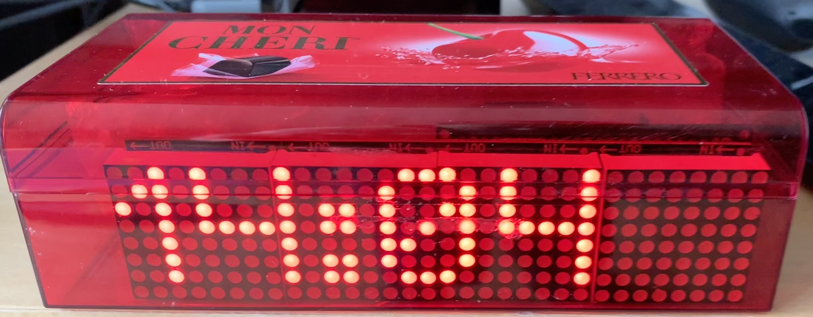
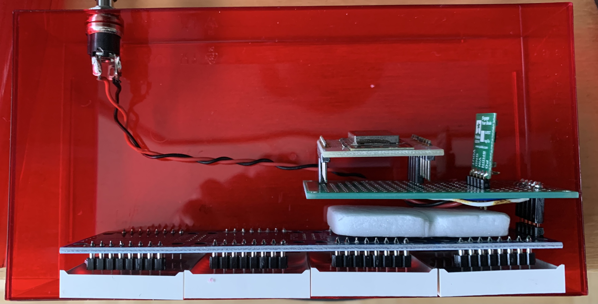

# matrixuhr
24(32)x8 Punktmatrixuhr mit MAX7219

Eine Uhr mit 3-4 8x8 Punktmatrix Modulen, welche einen MAX7219 Chip zur Ansteuerung verwenden.

Ich habe das Projekt mit einem ESP8266 (ESP12E) realisiert. Zum Programmieren verwende ich Visual Studio Code und PlatformIO.

So sieht die Elektronik innen aus:

P.S.: Die Mon Cheri(TM) Dose wurde gerade frei :-)
